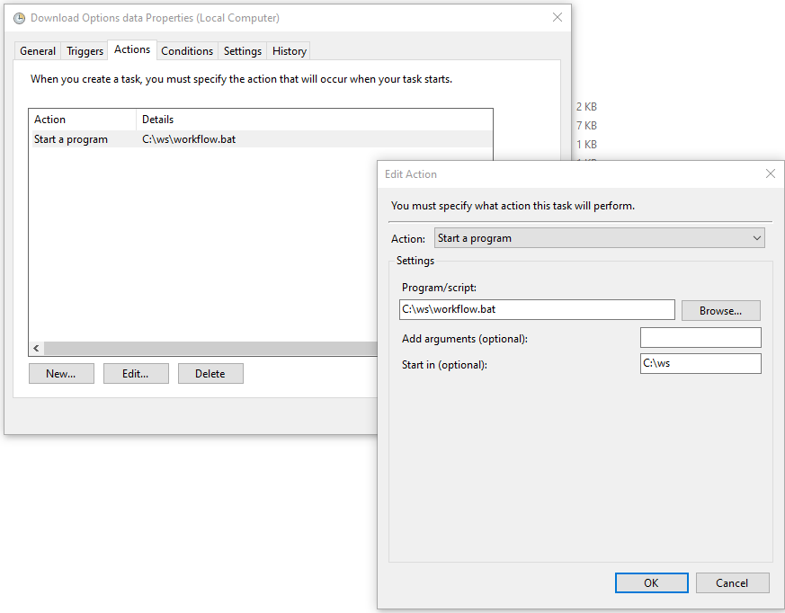

# appserver-infra

## Guide on how to setup the app

Setup a directory at c:\ws

Put the content of jobs and scripts into that folder.

Setup the windows scheduler to run the workflow.bat as described in the image below. Run on weekdays around 9AM morning.



For wsl and k9s port forwarding in windows system, 

open the startup directory `shell:startup` and create the shortcut pointing to the file `forward-port.ps1`

```powershell.exe -File "C:\ws\forward-port.ps1"```
